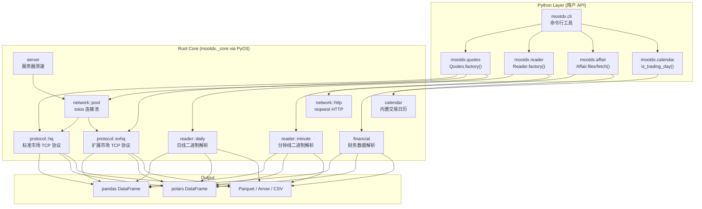

# mootdx v2: Rust + Python 混合架构重写计划

## 背景

`mootdx` 是一个中国通达信 (TDX) 股票数据读取接口，已 2 年未更新。经代码审查发现：依赖老化（httpx 版本冲突）、写死日期导致数据错误、全局单例线程不安全、`py_mini_racer` 跨平台构建困难等问题。决定采用 **Rust (PyO3 + Maturin) + Python 混合架构**进行全面重写。

## User Review Required

> [!IMPORTANT]
>
> - **破坏性变更**: 构建工具从 Poetry 迁移到 Maturin，用户需 `pip install` 预编译 wheel，不再需要本地编译 C++ 依赖
> - **依赖大幅精简**: 移除 `tdxpy`、`py_mini_racer`、`tenacity` 等，由 Rust 核心层替代
> - **新增可选依赖**: `polars` 作为可选的 DataFrame 后端

> [!WARNING]
>
> - TDX 二进制协议需要从 `tdxpy` 源码反向工程移植到 Rust，工作量较大
> - 扩展市场 (EX) 接口原项目已标注"已失效"，需确认是否仍需支持

---

## 架构总览



---

## 项目结构

```
mootdx/                          # 项目根目录
├── Cargo.toml                   # Rust workspace 配置
├── pyproject.toml               # Maturin 构建配置 (替代 poetry)
├── src/                         # Rust 源码
│   ├── lib.rs                   # PyO3 模块入口 (#[pymodule])
│   ├── protocol/
│   │   ├── mod.rs
│   │   ├── hq.rs                # 标准市场 HQ 协议解析
│   │   └── exhq.rs              # 扩展市场 EX 协议解析
│   ├── reader/
│   │   ├── mod.rs
│   │   ├── daily.rs             # VIPDOC 日线文件解析
│   │   └── minute.rs            # VIPDOC 分钟线文件解析
│   ├── network/
│   │   ├── mod.rs
│   │   ├── pool.rs              # tokio TCP 连接池
│   │   └── http.rs              # reqwest HTTP 客户端
│   ├── financial/
│   │   └── mod.rs               # 财务 ZIP 下载与二进制解析
│   ├── calendar/
│   │   └── mod.rs               # 内置中国交易日历 (静态数据)
│   └── server/
│       └── mod.rs               # 并发服务器测速
├── python/                       # Python 源码 (maturin python-source)
│   └── mootdx/
│       ├── __init__.py           # 版本号与公共导出
│       ├── _core.pyi             # Rust 模块类型桩
│       ├── quotes.py             # 行情 API (向后兼容)
│       ├── reader.py             # 离线读取 API (向后兼容)
│       ├── affair.py             # 财务数据 API (向后兼容)
│       ├── calendar.py           # 交易日历 API (新)
│       ├── server.py             # 服务器管理 API
│       ├── consts.py             # 常量定义
│       └── cli.py                # CLI 入口 (typer + rich)
├── tests/                        # pytest 测试
│   ├── test_reader.py
│   ├── test_quotes.py
│   ├── test_calendar.py
│   └── fixtures/                 # 测试用二进制样本
├── data/
│   └── calendar.json             # 交易日历静态数据源
├── docs/
│   └── plans/
│       └── 2026-04-29-rust-rewrite-design.md
└── .github/
    └── workflows/
        └── ci.yml                # 跨平台 wheel 构建
```

---

## Proposed Changes

### Phase 1: 基础设施搭建 + 本地二进制解析 (Week 1-2)

#### [NEW] pyproject.toml

替换 Poetry 为 Maturin 构建后端：

- `build-system.requires = ["maturin>=1.0,<2.0"]`
- `build-backend = "maturin"`
- Python 依赖精简为 `pandas`, `click` (或 `typer`)
- Optional: `polars`, `pyarrow`

#### [NEW] Cargo.toml

Rust workspace 配置：

- `pyo3 = { features = ["extension-module"] }`
- `tokio`, `reqwest`, `bytes`, `serde`, `serde_json`, `flate2`(ZIP)

#### [NEW] src/reader/daily.rs & minute.rs

移植 `tdxpy` 中的 `TdxDailyBarReader` 和 `TdxMinBarReader` 逻辑至 Rust：

- 使用内存映射 (`memmap2`) 读取 VIPDOC `.day` / `.lc1` / `.lc5` 文件
- 解析 `struct` 格式 (open, high, low, close, volume, amount)
- 通过 PyO3 返回为 `Vec<Bar>` → Python 端转为 DataFrame

#### [NEW] python/mootdx/reader.py

保持向后兼容的 API 签名：

```python
reader = Reader.factory(market='std', tdxdir='C:/new_tdx')
reader.daily(symbol='600036')  # 内部调用 _core.read_daily()
```

---

### Phase 2: 网络层 — TCP 协议 + 服务器发现 (Week 3-4)

#### [NEW] src/protocol/hq.rs

移植 `tdxpy.hq.TdxHq_API` 的 TDX 协议实现至 Rust：

- 二进制请求帧构建 (header, command, payload)
- 二进制响应解析 (K线, 报价, 分笔成交)
- 自动重连 + 心跳维持

#### [NEW] src/network/pool.rs

基于 tokio 的 TCP 连接池：

- 支持并发请求多个 symbol
- 超时管理与自动故障转移
- 替代原有的全局 `instance` 单例

#### [NEW] src/server/mod.rs

并发服务器测速：

- 使用 tokio 异步并发 TCP ping 所有 HQ/EX/GP 服务器
- 返回按延迟排序的服务器列表
- 配置持久化到 JSON 文件

#### [NEW] python/mootdx/quotes.py

向后兼容包装：

```python
client = Quotes.factory(market='std')
client.bars(symbol='600036', frequency=9)  # 内部调用 _core
```

---

### Phase 3: 财务数据 + 交易日历 (Week 5-6)

#### [NEW] src/financial/mod.rs

- 使用 `reqwest` 下载财务 ZIP 文件（替代 httpx）
- 使用 `flate2` 解压，Rust 解析二进制财务数据格式
- MD5 校验跳过已下载文件

#### [NEW] src/calendar/mod.rs

内置中国交易日历（**彻底消除 `py_mini_racer` 依赖**）：

- 将历史交易日历嵌入为 Rust 编译期静态数据
- 提供 `is_trading_day(date)`, `next_trading_day(date)`, `trading_days(start, end)` 等 API
- 通过 GitHub Release 定期更新日历数据文件

#### [DELETE] mootdx/utils/holiday.py & holiday.js

完全移除 Sina 爬虫和 V8 JS 解析逻辑。

---

### Phase 4: 新功能 + 发布 (Week 7-8)

#### 新功能清单

| 功能                   | 说明                                                         |
| ---------------------- | ------------------------------------------------------------ |
| **Polars 支持**        | `client.bars(..., backend='polars')` 返回 `polars.DataFrame` |
| **Parquet/Arrow 导出** | `_core.to_parquet(data, path)` 原生导出                      |
| **完整 .pyi 桩**       | 所有 Rust 函数的类型提示 → IDE 自动补全                      |
| **现代 CLI**           | 用 `typer` + `rich` 替代旧的 `click` CLI                     |
| **北交所支持**         | 确认 `MARKET_BJ=2` 相关接口完整性                            |
| **连接池统计**         | 暴露连接延迟、重连次数等监控指标                             |

#### [NEW] .github/workflows/ci.yml

跨平台 CI/CD：

- 使用 `maturin-action` 自动构建 wheel
- 矩阵: `{ubuntu, macos-arm, macos-x86, windows}` × `{python 3.9-3.12}`
- 自动发布至 PyPI

---

## Verification Plan

### 自动化测试

1. **Phase 1 回归验证** — 对比 Rust reader 与原 Python reader 输出：

   ```bash
   # 使用现有 test fixtures (tests/fixtures/ 目录下有 84 个测试样本文件)
   cd e:\DEV\mootdx
   # 构建 Rust 模块
   maturin develop --release
   # 运行 reader 回归测试
   pytest tests/test_reader_regression.py -v
   ```

   - 测试用例: 对同一个 `.day` / `.lc1` 文件，分别用旧 Python reader 和新 Rust reader 解析，assert DataFrame 值完全一致

2. **Phase 2 网络层验证** — 在线接口集成测试：

   ```bash
   pytest tests/test_quotes_integration.py -v --timeout=30
   ```

   - 测试用例: 连接实际 TDX 服务器，获取 `600036` 最近 10 根日K线，验证非空且包含 OHLCV 字段
   - 测试用例: 服务器测速返回至少 1 个可用节点

3. **Phase 3 日历验证**：

   ```bash
   pytest tests/test_calendar.py -v
   ```

   - 测试用例: `is_trading_day('2025-01-01')` → `False` (元旦)
   - 测试用例: `is_trading_day('2025-01-02')` → `True` (工作日)
   - 测试用例: `trading_days('2025-01-01', '2025-01-31')` 返回约 20 个交易日

4. **Phase 4 功能验证**：
   ```bash
   pytest tests/ -v --timeout=60
   ```

### 手动验证

> [!NOTE]
> 以下手动测试需要用户在本地有通达信安装目录 (VIPDOC 数据) 和网络环境。

1. **本地数据读取**: 在 Python REPL 中运行：

   ```python
   from mootdx.reader import Reader
   reader = Reader.factory(market='std', tdxdir='你的通达信路径')
   df = reader.daily(symbol='600036')
   print(df.head())  # 应返回含 open/high/low/close/vol/amount 的 DataFrame
   ```

2. **在线行情获取**: 在 Python REPL 中运行：

   ```python
   from mootdx.quotes import Quotes
   client = Quotes.factory(market='std')
   df = client.bars(symbol='600036', frequency=9, offset=10)
   print(df)  # 应返回最近 10 根日K线
   ```

3. **跨平台构建验证**: 在 GitHub Actions 中通过 CI 矩阵确认 wheel 构建成功（Linux/macOS/Windows）。
